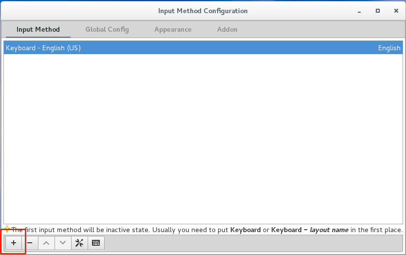
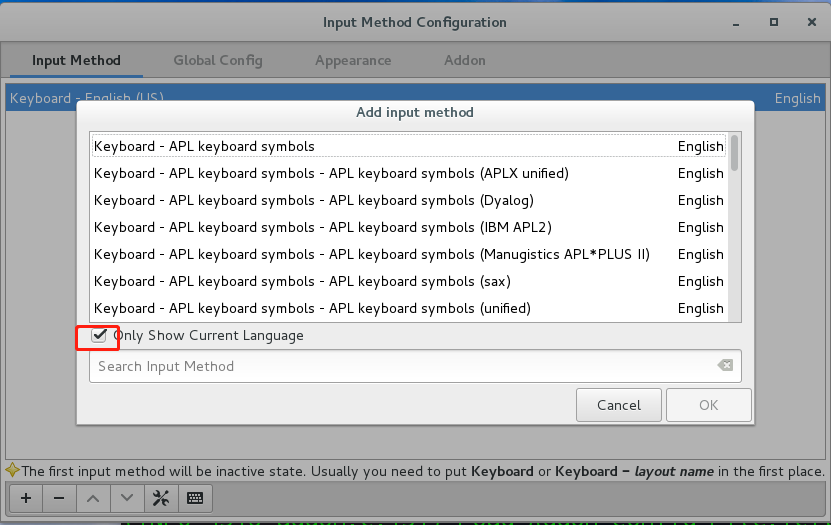
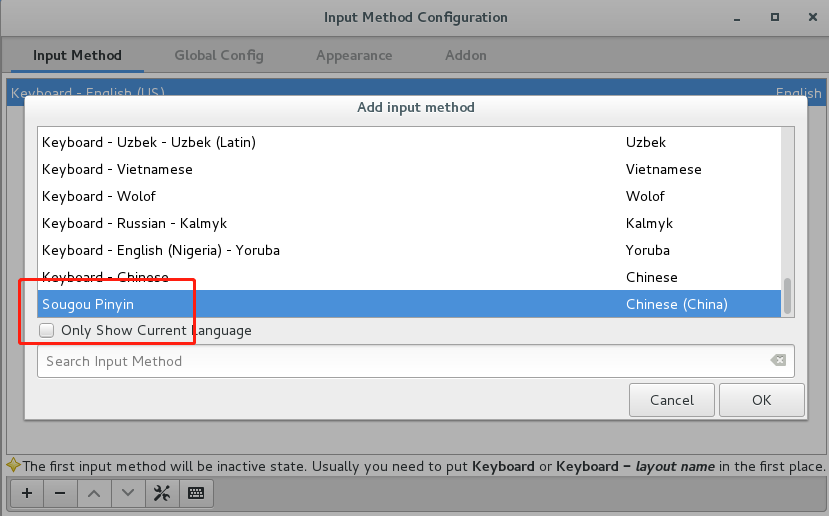
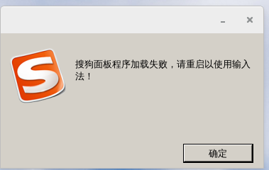

Centos 7 自带的中文输入法比较难用，就想着在Centos上安装搜狗输入法，结果发现，
搜狗输入法只支持Ubuntu。通过查阅相关资料，加上自己的摸索，最终在系统上安装上了
搜狗输入法，本博客就记录一下在Centos 7上安装搜狗输入法的过程（暂时只测试了Centos7，
其他系统没有测试）。

另外，本博客主要参考了sogou输入法论坛中[jeyCheng的博客](http://pinyin.sogou.com/bbs/forum.php?mod=viewthread&tid=2692406&highlight=centos)
，在此表示感谢。

## 0. 配置清华开源镜像

**该步骤并不是必须的。**
如果是教育网用户，推荐使用清华开源镜像，因为支持IPV6，下载的速度比较快。（下面的
步骤适用于Centos 7, 如果是其他的系统，请参考[此链接](https://mirrors.tuna.tsinghua.edu.cn/help/centos/)）
```shell
# 备份原先的CentOS-Base.repo
$ sudo mv /etc/yum.repos.d/CentOS-Base.repo /etc/yum.repos.d/CentOS-Base.repo.bak
# 新建一个CentOS-Base.repo
$ sudo vim /etc/yum.repos.d/CentOS-Base.repo
```
然后将下面的内容复制到CentOS-Base.repo文件中，然后保存退出
```raw
# CentOS-Base.repo
#
# The mirror system uses the connecting IP address of the client and the
# update status of each mirror to pick mirrors that are updated to and
# geographically close to the client.  You should use this for CentOS updates
# unless you are manually picking other mirrors.
#
# If the mirrorlist= does not work for you, as a fall back you can try the
# remarked out baseurl= line instead.
#
#

[base]
name=CentOS-$releasever - Base
baseurl=https://mirrors.tuna.tsinghua.edu.cn/centos/$releasever/os/$basearch/
#mirrorlist=http://mirrorlist.centos.org/?release=$releasever&arch=$basearch&repo=os
gpgcheck=1
gpgkey=file:///etc/pki/rpm-gpg/RPM-GPG-KEY-CentOS-7

#released updates
[updates]
name=CentOS-$releasever - Updates
baseurl=https://mirrors.tuna.tsinghua.edu.cn/centos/$releasever/updates/$basearch/
#mirrorlist=http://mirrorlist.centos.org/?release=$releasever&arch=$basearch&repo=updates
gpgcheck=1
gpgkey=file:///etc/pki/rpm-gpg/RPM-GPG-KEY-CentOS-7

#additional packages that may be useful
[extras]
name=CentOS-$releasever - Extras
baseurl=https://mirrors.tuna.tsinghua.edu.cn/centos/$releasever/extras/$basearch/
#mirrorlist=http://mirrorlist.centos.org/?release=$releasever&arch=$basearch&repo=extras
gpgcheck=1
gpgkey=file:///etc/pki/rpm-gpg/RPM-GPG-KEY-CentOS-7

#additional packages that extend functionality of existing packages
[centosplus]
name=CentOS-$releasever - Plus
baseurl=https://mirrors.tuna.tsinghua.edu.cn/centos/$releasever/centosplus/$basearch/
#mirrorlist=http://mirrorlist.centos.org/?release=$releasever&arch=$basearch&repo=centosplus
gpgcheck=1
enabled=0
gpgkey=file:///etc/pki/rpm-gpg/RPM-GPG-KEY-CentOS-7
```
最后通过下面的命令，更新软件包缓存
```shell
$ sudo yum makecache
```

## 1. 配置 epel 源

首先按照下面的命令配置epel源。

```shell
$ sudo yum install -y epel-release
$ sudo yum clean all
$ sudo yum makecache
```

epel源平常用的还是听多的，而且此时必须匹配，如果不配置，可能出现的错误有

```shell
Error: Package: fcitx-configtool-0.4.7-4.el7.centos.x86_64.rpm
    Requires: libunique-1.0.so.0()(64bit)
You could try using --skip-broken to work around the problem
You could try running: rpm -Va --nofiles --nodigest
```

## 2. 卸载ibus
Centos 7的输入法是基于ibus的，而搜狗拼音是基于fcitx的，如果不卸载，可能会发生冲突，
这里为了方便和减少出错的可能性，直接卸载ibus。

```shell
$ sudo yum remove -y ibus
```

## 3. 安装fcitx及其相关依赖
```shell
$ sudo yum install -y dpkg fcitx fcitx-devel fcitx-configtool qtwebkit
```
如果后续仍然出错，通过下面命令将与`fcitx`相关的软件全部按上
```shell
$ sudo yum install -y fcitx*
```
注意：如果没有正确安装，可能会缺少某些依赖，例如
```shell
Error: Package: fcitx-configtool-0.4.7-4.el7.centos.x86_64 (/fcitx-configtool-0.4.7-4.el7.centos.x86_64)
    Requires: libfcitx-gclient.so.0()(64bit)
You could try using --skip-broken to work around the problem
```

## 4. 下载需要的文件
```shell
$ git clone https://github.com/hydrogenlee/sogou-input-in-centos7.git
$ cd sogou-input-in-centos7.git
```

## 5. 安装搜狗输入法
```shell
$ sudo yum install sogou-pinyin-1.1.0.0037-1.el7.centos.x86_64.rpm
```

## 6. 配置环境变量
新建sogou-input.sh配置文件
```shell
$ sudo vim /etc/profile.d/sogou-input.sh
```
写入如下配置
```shell
# sogou-input
export GTK_IM_MODULE=fcitx
export XMODIFIERS="@im=fcitx"
export QT_IM_MODULE=fcitx
```
使环境变量生效
```shell
$ source /etc/profile
```

## 7. 搜狗输入法后序配置
```shell
# 关闭 gnome-shell 对键盘的监听
$ gsettings set org.gnome.settings-daemon.plugins.keyboard active false
# 切换输入法为 fcitx
$ imsettings-switch fcitx
# 然后重启一下电脑
$ reboot
```

## 8. 最后配置一下输入法
```shell
# 重启fcitx
$ fcitx -r
# 配置搜狗输入法
$ fcitx-configtool
```
然后按照下面的步骤添加搜狗输入法




**最后通过`ctrl + 空格`调出搜狗输入法**
如果出现下面的情况，可能需要再重启一次


## 9. 如果有新版本，通过下面的命令进行更新
```shell
$ ar vx sogoupinyin_2.2.0.0108_amd64.deb
$ sudo tar -Jxvf data.tar.xz -C /
$ sudo cp /usr/lib/x86_64-linux-gnu/fcitx/fcitx-sogoupinyin.so /usr/lib64/fcitx/fcitx-sogoupinyin.so
```
最后重启电脑（如果出现问题，可能需要删除`~/.config/SogouPY`文件夹）

